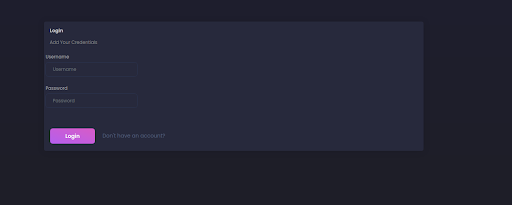
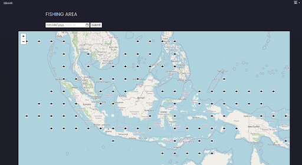
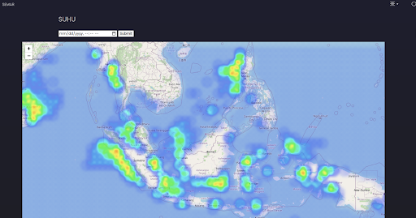

# Semar Dashboard
###### This project is written for System Analysis subject in Master of IT, University of Indonesia 
###### What it does:
- Download current, temperature, and chlorophyl data from Copernicus 
- Process data from Copernicus to generate possible fishing location
- Publish temperature data and current data as heatmap using leaflet js
- The purpose of this website is to help fisherman locate their nearest possible fishing location
- This project is part of collaboration with BRIN (Badan Riset dan Inovasi Nasional)

